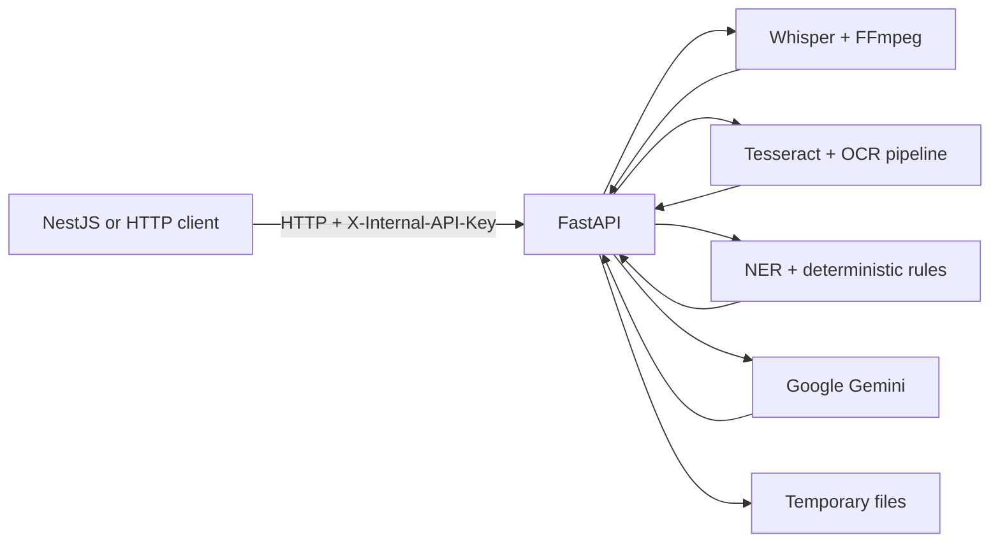

# Sehat-Setu AI Service

FastAPI microservice for local faster-whisper transcription, live audio sessions, medical entity extraction, OCR, Gemini-assisted summaries/prescription drafts/diet guidance, and rule-first doctor-category routing.

> This service owns AI processing. Other services integrate over HTTP; they do not import its Python code or duplicate its pipelines.

## Features

- Upload and live transcription with FFmpeg normalization, VAD, medical prompting, quality warnings, and optional bounded second pass.
- Local-first Tesseract OCR with preprocessing, short-lived in-memory caching, and optional Gemini fallback.
- Deterministic plus optional biomedical-NER medical extraction.
- Gemini-backed consultation summaries, prescription drafts, and diet guidance.
- Rule-first doctor specialization recommendation with optional Gemini fallback.
- Health/readiness diagnostics, OpenAPI, synthetic benchmarks, and a local evaluation dashboard.



## Repository layout

| Path | Responsibility |
|---|---|
| `app/api/v1/endpoints/` | HTTP and WebSocket routes |
| `app/schemas/` | Pydantic request/response contracts |
| `app/services/` | Voice, OCR, extraction, Gemini, and domain services |
| `app/resources/medical_vocabulary/` | Patient-independent medical terms and aliases |
| `scripts/` | Validation, benchmark, report, and dataset tools |
| `tests/` | Tracked automated tests and fixtures |
| `evaluation_dashboard/` | Local report viewer generator |
| `config/` | Example Whisper profiles |

## Quick start

Required: Python 3.12+, FFmpeg, and Tesseract with English data. From `ai-service/`:

```powershell
python -m venv .venv
.\.venv\Scripts\python.exe -m pip install -r requirements.txt
Copy-Item .env.example .env
.\.venv\Scripts\python.exe -m uvicorn app.main:app --host 127.0.0.1 --port 8001
```

- Public process liveness: `GET http://127.0.0.1:8001/healthz`
- Swagger UI: `http://127.0.0.1:8001/docs`
- OpenAPI: `http://127.0.0.1:8001/openapi.json`
- Tests: `.\.venv\Scripts\python.exe -m pytest`

## Status and limitations

The automated suite covers contracts and local pipelines. Current benchmark artifacts are synthetic or deterministic unless explicitly labeled otherwise. Human English/Hindi/Hinglish voice validation, a real Chrome MediaRecorder test, and an authorized Render smoke test remain required. Gemini operations depend on credentials, network access, and provider quota. AI-generated clinical content always requires professional review.

## Documentation

- [Integration guide](docs/AI_SERVICE_INTEGRATION.md)
- [API contract](docs/API_CONTRACT.md)
- [Architecture](docs/ARCHITECTURE.md)
- [Environment variables](docs/ENVIRONMENT_VARIABLES.md)
- [Running locally](docs/RUNNING_LOCALLY.md)
- [Deployment](docs/DEPLOYMENT.md)
- [Testing and benchmarks](docs/TESTING_AND_BENCHMARKS.md)
- [Troubleshooting](docs/TROUBLESHOOTING.md)
- [Contributing](docs/CONTRIBUTING.md)
        