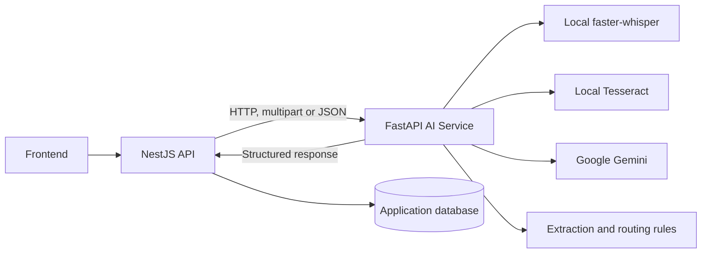
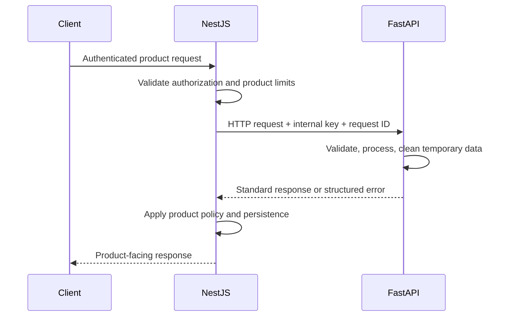
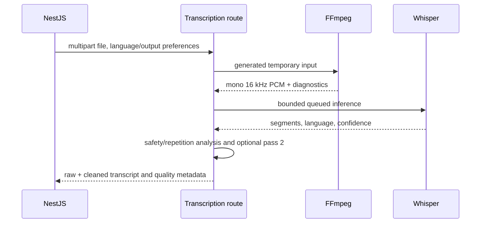
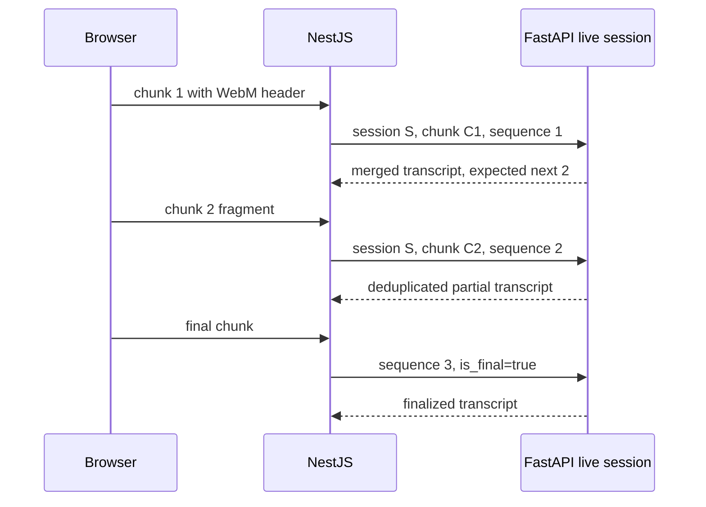
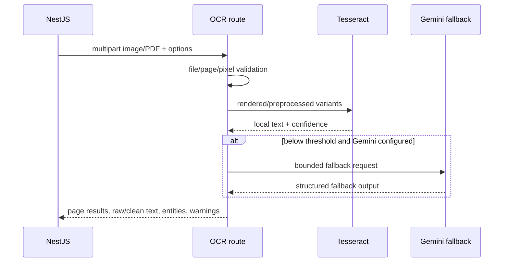

# AI Service Integration Guide

[Documentation index](../README.md) · [API contract](API_CONTRACT.md) · [Environment](ENVIRONMENT_VARIABLES.md) · [Deployment](DEPLOYMENT.md)

## Purpose and ownership

Sehat-Setu AI Service is the source of truth for OCR, Whisper transcription, language handling, medical extraction, Gemini prompts/provider calls, clinical draft schemas, and AI quality metadata. NestJS owns orchestration, authentication toward end users, persistence, and product workflows. Integration is HTTP/WebSocket only.

The AI service is database-independent. It receives only the minimum content required for one operation and does not share Prisma models or NestJS modules.



## Startup and health

1. Start/install native dependencies and AI service.
2. Wait for public `GET /healthz` to return 200.
3. Call protected `GET /api/v1/health` with the internal key and inspect FFmpeg/OCR/Whisper/provider readiness.
4. Start or enable NestJS workflows that depend on AI.

`/healthz` does not load Whisper and does not prove Gemini quota or first model download. Treat detailed health as capability metadata, not a reason to crash NestJS when one optional provider is unavailable.

## Connection configuration

NestJS should configure:

| Setting | Recommendation |
|---|---|
| Base URL | Internal AI-service origin, without trailing endpoint path |
| Authentication | `X-Internal-API-Key` from server-side secret storage |
| JSON timeout | Greater than provider timeout plus small transport margin |
| Voice timeout | At least `TRANSCRIPTION_REQUEST_TIMEOUT_SECONDS` plus transport margin |
| OCR timeout | At least `OCR_REQUEST_TIMEOUT_SECONDS` plus margin |
| Request ID | Send a valid `X-Request-ID` (8–64 safe characters) for correlation |
| Body limits | Allow AI upload limit plus multipart overhead |

Never expose the internal key to the browser. NestJS forwards files as streams/multipart; it should not deserialize and re-encode binary media unnecessarily.

## Calling pattern



NestJS must forward or record the AI `meta.request_id` and should retain its own correlation ID. Do not depend on exact wording in `message`; branch on HTTP status and stable `error.code`.

## Multipart upload

For `/api/v1/transcribe`, `/api/v1/live-transcription/chunk`, and `/api/v1/ocr/analyze`:

- Preserve the original safe filename extension and a truthful MIME type.
- Stream the binary part; do not send base64 JSON.
- Do not reuse a consumed stream on retry.
- Enforce product-side size limits before forwarding.
- Retry only after creating a fresh readable stream.

Conceptual TypeScript (library-independent):

```ts
const form = new FormData();
form.append("file", fileBlob, safeFilename);
form.append("language", "auto");

const response = await fetch(`${aiBaseUrl}/api/v1/transcribe`, {
  method: "POST",
  headers: {
    "X-Internal-API-Key": aiKey,
    "X-Request-ID": requestId,
  },
  body: form,
  signal: AbortSignal.timeout(aiVoiceTimeoutMs),
});
```

Do not manually set multipart `Content-Type`; the HTTP implementation must add its boundary.

## Retry and failure policy

| Result | NestJS behavior |
|---|---|
| 400/413/415/422 | Do not retry unchanged input; return a safe product validation error. |
| 401 | Configuration incident; never retry with user credentials. |
| 429 | Retry idempotent operations with exponential backoff/jitter; respect provider pressure. |
| 502/503 | At most a small bounded retry for idempotent calls; prevent retry storms. |
| 504/transport timeout | Outcome may be unknown; retry only idempotent requests and avoid duplicate product side effects. |
| 500 | Log request ID; fail safely. Retry only when explicitly classified transient. |

Do not stack large NestJS retries on top of FastAPI’s Gemini retries. OCR/transcription uploads are computationally expensive; prefer one controlled retry after transient infrastructure failure.

Parse error bodies defensively. If the body is unavailable or invalid JSON, retain HTTP status and request correlation without fabricating an AI result.

## Voice flow



NestJS should store/display `raw_transcript` as evidence when authorized and use `cleaned_transcript` for presentation. Never silently replace raw text with `corrections_applied`; those are review candidates. Surface quality and disagreement warnings to the clinician. `hi-Latn` is an output preference; it maps to Hindi inference and optional Romanization, not a native Whisper code.

## Live transcription flow

REST chunk integration is simplest for NestJS proxying:

1. Generate a stable `session_id`.
2. Send unique `chunk_id` and monotonically increasing one-based `sequence_number`.
3. Keep the first WebM container/header data available; later MediaRecorder fragments may not decode alone.
4. Send `is_final=true` for the last complete chunk.
5. Treat duplicate acknowledgement as success.
6. On out-of-order error, resume from `expected_next_chunk`; do not skip silently.
7. Stop retaining session data after finalization/cancellation/TTL.



For direct WebSocket use, follow the control-message/binary-frame protocol described in [API Contract](API_CONTRACT.md#ws-apiv1live-transcriptionws). Send `X-Internal-API-Key` from server clients. A browser that cannot set custom headers may use the documented `api_key` query parameter over TLS, although proxying through authenticated NestJS remains preferable. Process-local sessions require sticky routing if more than one AI replica exists.

## OCR flow



NestJS must not duplicate OCR preprocessing or normalization. Preserve provider/confidence/fallback/warning metadata. A low-confidence successful response is not equivalent to a high-confidence document; route it to review.

## Medical extraction flow

Call `/api/v1/extract-medical-info` with transcript text. It returns structured symptoms, negated findings, conditions, medicines, durations, vitals, allergies, and procedures. Missing fields remain empty/null; NestJS must not infer diagnoses or fill absent values. Preserve source evidence fields when present.

## Summary, prescription, and diet

- `/generate-summary`: consultation summary from transcript and optional extracted entities.
- `/generate-prescription`: doctor-reviewed prescription draft from a summary/context.
- `/summarize`: legacy/raw-transcript-to-prescription-draft workflow; its response differs from `/generate-summary`.
- `/diet-recommendation`: doctor-reviewed dietary guidance.

These operations depend on Gemini except where an explicit dummy/fallback behavior is configured. Always surface `requires_doctor_review`/confirmation flags and disclaimers. Never turn a draft into an issued prescription automatically.

## Doctor routing

`/recommend-doctor` returns a controlled specialization and urgency from rules, with optional Gemini fallback. NestJS may pass its unmodified Google Places results as optional `nearby_hospitals`; the AI service preserves each payload under `raw`, cautiously classifies the facility, and ranks emergency suitability. Ranking prioritizes reported-open status, emergency/trauma capability signals, condition-relevant speciality signals, distance, and operational status. Rating/review volume are only tie-strengthening secondary factors. Unknown ownership never excludes a nearby facility.

Classification priority is trusted internal metadata (`verifiedHospitalType`/`verifiedSpecialities`), deterministic India-focused keyword rules, an optional injected AI classifier, then `unknown`. Keyword and AI results are explicitly inferred, not verified facts. Display `hospital_classification_notice`, and independently verify hospital ownership, speciality, opening hours, and emergency capability whenever circumstances permit. This service does not rank clinicians, query live availability, or create appointments.

## Response handling

- Ignore unknown optional fields for forward compatibility.
- Require the endpoint’s documented required `data` fields before use.
- Preserve null versus zero and empty versus unavailable.
- Log status, error code, and request ID; avoid full clinical payloads.
- Map internal failures to safe product language without exposing provider stack traces.

## Concurrency and state

Upload transcription, OCR, and provider calls have process-local bounds. Live sessions and OCR cache are process-local. One Uvicorn worker is the current Docker configuration. NestJS should apply its own admission control and must not assume session/cache continuity across replicas or restarts.

## Docker and Render notes

The AI container listens on port 8001 and uses one worker. FFmpeg/Tesseract are installed. Whisper downloads lazily; provider credentials are runtime secrets. Render probes `/healthz`. A green deploy still requires capability smoke tests. See [Deployment](DEPLOYMENT.md).

## Integration checklist

- [ ] Base URL points to the AI service, not the NestJS service.
- [ ] Internal key is server-only and sent on protected calls.
- [ ] Timeouts exceed the matching AI budget.
- [ ] Multipart streams preserve filename, MIME, and boundary.
- [ ] 4xx failures are not retried unchanged.
- [ ] Retry counts are bounded and idempotency-aware.
- [ ] `error.code` and `meta.request_id` are recorded.
- [ ] Raw/cleaned text and confidence/review metadata remain distinct.
- [ ] Clinical drafts always require clinician review.
- [ ] Live chunks use stable session IDs and monotonic indices.
- [ ] Startup checks use `/healthz` then protected `/api/v1/health`.
- [ ] Human/browser/authorized runtime smoke validation is recorded separately.

## Known limitations

- No shared database or durable job queue.
- Whisper/NER caches and live/OCR state are process-local.
- Model download and Gemini require network access unless cached/not used.
- Human voice validation is not represented by current synthetic artifacts.
- Hindi/Hinglish en-US TTS is not valid acoustic evidence.
- Provider availability and quota cannot be guaranteed by health alone.
- Direct live-transcription WebSockets require the internal key when configured; a trusted network or authenticated proxy is still recommended.

## Future extensions

Add providers through service adapters/protocols, add fields as optional schema properties, and add new versioned endpoints only when an existing contract cannot represent the workflow. Prefer queue/orchestration changes in NestJS over embedding product persistence in FastAPI.

# Instructions for AI Coding Agents

These instructions are mandatory.

- Treat this service as the source of truth for AI.
- Never duplicate OCR.
- Never duplicate Whisper.
- Never duplicate Gemini.
- Never duplicate extraction logic.
- Communicate only through HTTP.
- Do not import Python into NestJS.
- Do not couple databases.
- Do not change endpoint paths.
- Do not change response schemas.
- Optional fields are safe.
- Prefer adapters over endpoint changes.
- If integration fails, fix the integration, not the AI service, unless an API contract bug exists.

Before generating integration code, read [API Contract](API_CONTRACT.md), use the current OpenAPI schema, and preserve authentication, timeout, error, evidence, and doctor-review semantics.
