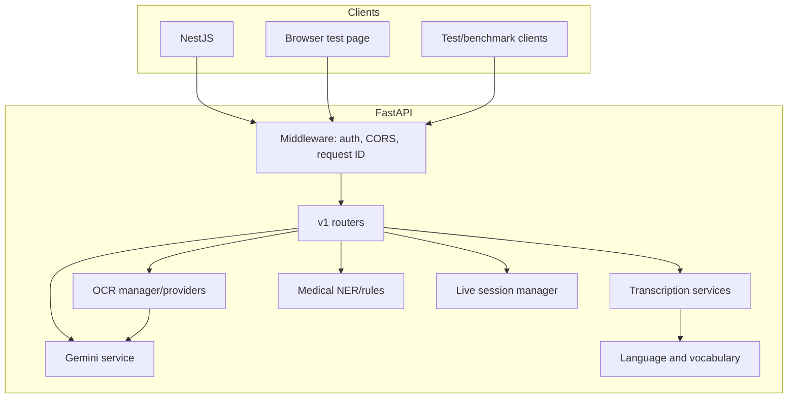
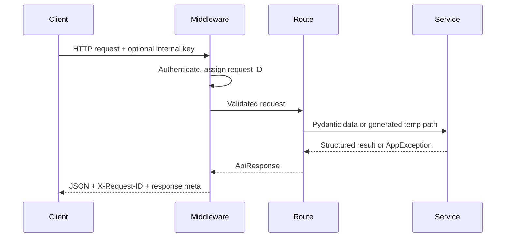

# Architecture

[Documentation index](../README.md) · [API](API_CONTRACT.md) · [Integration](AI_SERVICE_INTEGRATION.md)

## Boundaries

The FastAPI process owns AI inference and patient-content processing. It has no database dependency. Incoming files are written under the configured temporary directory using generated names, processed, and removed in endpoint `finally` blocks. Process-local models, session state, semaphores, and caches are not shared across replicas.



## Directory tree

```text
ai-service/
├── app/
│   ├── api/v1/endpoints/     # route handlers
│   ├── core/                 # settings, logging, FFmpeg, exceptions
│   ├── prompts/              # prompt builders
│   ├── resources/            # medical vocabulary
│   ├── schemas/              # Pydantic contracts
│   ├── services/             # pipeline implementations
│   ├── static/               # local microphone test page
│   └── main.py               # app factory and middleware
├── config/                   # voice profile examples
├── docs/                     # operator/integrator documentation
├── evaluation_dashboard/     # report loader and HTML generator
├── scripts/                  # benchmarks and verification
└── tests/                    # tracked tests and synthetic fixtures
```

## Request lifecycle



All JSON responses pass through metadata middleware, which adds `meta.request_id` and `meta.processing_time_ms`. Errors use the registered standard error envelope.

## Voice pipeline

```mermaid
flowchart LR
  U[Multipart audio] --> Validate[Filename, MIME, size]
  Validate --> Temp[Generated temporary file]
  Temp --> FF[FFmpeg: mono 16 kHz PCM]
  FF --> Speech[RMS/VAD checks]
  Speech --> Queue[Bounded semaphore]
  Queue --> W[Lazy faster-whisper model]
  W --> Quality[Repetition/confidence/safety analysis]
  Quality -->|uncertain| P2[Bounded alternate decode]
  Quality --> Select[Safety-first selection]
  P2 --> Select
  Select --> Clean[Separate deterministic cleanup]
  Clean --> Response[Raw + cleaned + optional quality metadata]
```



One model instance is loaded lazily per process under an initialization lock. `hi-Latn` maps to Whisper language `hi`; optional offline romanization is separate. Raw selected model text is preserved. Candidate medicine corrections require context and review.

## Live transcription

REST and WebSocket routes share bounded process-local session state. Sessions track expected sequence, processed/attempted chunk IDs, merged transcript, detected language, pending work, pause state, and last activity. TTL cleanup and maximum-session/pending-chunk settings bound memory. Since state is process-local, sticky routing or one replica is required for resumable sessions.

## OCR pipeline

```mermaid
flowchart LR
  D[Image/PDF] --> Guard[Size/type/page/pixel guards]
  Guard --> Render[Render PDF pages]
  Render --> Prep[Conservative variants]
  Prep --> T[Tesseract provider]
  T --> Policy[Confidence policy]
  Policy -->|low confidence + key| G[Gemini vision fallback]
  Policy --> Normalize[Deterministic normalization/extraction]
  G --> Normalize
  Normalize --> Cache[Short-lived SHA-256 in-memory cache]
  Cache --> Result[Page diagnostics + structured response]
```



OCR providers implement a provider-neutral interface. Tesseract is local-first. Gemini fallback is optional and failure does not erase usable local text.

## Gemini and deterministic pipelines

- `GeminiService` owns structured provider calls, timeouts, retries, and response validation.
- Summary, prescription, and diet services use controlled schemas and retain doctor-review flags.
- Doctor recommendation uses deterministic category rules first and Gemini only as configured fallback.
- Medical extraction combines regex/lexicons with an optional locally cached Transformers classifier; missing model files fall back to deterministic logic.

## Caching and concurrency

| Resource | Scope | Bound |
|---|---|---|
| Whisper model | Process | One lazy instance |
| Upload transcription | Process | Semaphore and queue timeout |
| Live sessions | Process | TTL, session, pending-chunk, chunk-size limits |
| OCR cache | Process memory | TTL |
| Provider calls | Process | Configured concurrency/timeouts |

## Health and observability

`/healthz` is the public lightweight process probe. `/api/v1/health` exposes configured FFmpeg, OCR, Whisper, and provider readiness without forcing Whisper model load and requires the internal key when configured. Logs include request IDs and operational metadata, not raw audio or full transcripts at normal levels.

## Evaluation dashboard

`python -m evaluation_dashboard.app` reads local JSON artifacts, redacts sensitive keys, preserves missing values as “Not measured,” and generates `test/consolidated/reports/evaluation-dashboard.html`. The entire `test/` tree is ignored and intended for local evaluation output.
## Hospital interpretation and emergency ranking

`HospitalEnrichmentService` is a deterministic, provider-independent layer called by the doctor-recommendation service. Pydantic accepts partial Google Places records and retains unknown provider fields. Classification follows trusted internal metadata, India-focused keyword rules, an optional AI callback, then `unknown`. Conflicting ownership evidence fails closed to `unknown`.

The 100-point emergency score allocates 25 points to reported-open status, 25 to emergency/trauma indicators, 25 to condition-speciality relevance, up to 20 to distance (`20 / (1 + metres / 5000)`), 10 to an operational listing, and at most 5 combined to rating and review count. Unknown opening/status receives only small neutral-preservation points. Closed or non-operational facilities remain visible with warnings rather than being silently removed.
